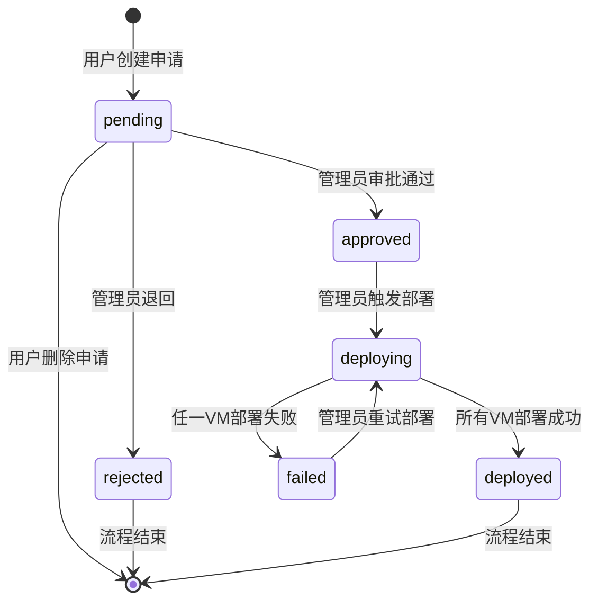

# VMware 虚拟机资源申请系统 - 实施计划

## 文档版本
- **版本**: 1.0
- **创建日期**: 2026-01-28
- **最后更新**: 2026-01-28

## 目录
1. [系统概述](#系统概述)
2. [数据库设计](#数据库设计)
3. [后端实现](#后端实现)
4. [前端实现](#前端实现)
5. [部署流程设计](#部署流程设计)
6. [风险缓解措施](#风险缓解措施)
7. [实施顺序](#实施顺序)
8. [测试策略](#测试策略)

---

## 系统概述

### 功能范围
- 用户侧：资源申请表单、申请单查看、多虚机批量申请
- 管理员侧：申请单审批、部署参数配置、GPU资源管理、网络池管理
- 自动化：VMware API集成、GPU直通、IP自动分配、部署状态跟踪
- 项目联动：部署成功后自动关联到项目管理模块

### 技术栈
- **后端**: Express.js + TypeScript + PostgreSQL
- **前端**: React + Ant Design + TypeScript
- **VMware集成**: vSphere SOAP/REST API
- **认证**: JWT (复用现有auth中间件)

### 网络环境映射
```
开发环境 → 10.0.102.0/24
测试环境 → 10.0.101.0/24
生产环境 → 10.0.100.0/24
```

---

## 数据库设计

### 迁移脚本 (migration_001_resource_requests.sql)

```sql
-- ============================================
-- 资源申请系统数据库迁移脚本
-- 版本: 1.0
-- ============================================

-- 1. 资源申请单表
CREATE TABLE resource_requests (
    id SERIAL PRIMARY KEY,
    request_number VARCHAR(50) UNIQUE NOT NULL, -- 申请单号 RQ20260128001
    user_id INTEGER NOT NULL REFERENCES users(id) ON DELETE CASCADE,
    project_id INTEGER REFERENCES projects(id) ON DELETE SET NULL,

    -- 申请信息
    purpose TEXT NOT NULL, -- 申请用途
    environment VARCHAR(20) NOT NULL CHECK (environment IN ('development', 'testing', 'production')),

    -- 状态管理
    status VARCHAR(20) NOT NULL DEFAULT 'pending' CHECK (status IN ('pending', 'approved', 'deploying', 'deployed', 'rejected', 'failed')),
    admin_notes TEXT, -- 管理员备注
    rejection_reason TEXT, -- 退回原因

    -- 时间戳
    created_at TIMESTAMP NOT NULL DEFAULT CURRENT_TIMESTAMP,
    updated_at TIMESTAMP NOT NULL DEFAULT CURRENT_TIMESTAMP,
    approved_at TIMESTAMP,
    deployed_at TIMESTAMP,
    approved_by INTEGER REFERENCES users(id) ON DELETE SET NULL,

    -- 索引
    CONSTRAINT valid_approval CHECK (
        (status IN ('approved', 'deploying', 'deployed') AND approved_by IS NOT NULL) OR
        (status NOT IN ('approved', 'deploying', 'deployed'))
    )
);

CREATE INDEX idx_resource_requests_user ON resource_requests(user_id);
CREATE INDEX idx_resource_requests_status ON resource_requests(status);
CREATE INDEX idx_resource_requests_created ON resource_requests(created_at DESC);
CREATE INDEX idx_resource_requests_project ON resource_requests(project_id);

-- 2. 虚拟机申请明细表
CREATE TABLE vm_request_items (
    id SERIAL PRIMARY KEY,
    request_id INTEGER NOT NULL REFERENCES resource_requests(id) ON DELETE CASCADE,

    -- 虚机配置
    vm_name VARCHAR(100), -- 部署后填充
    template_name VARCHAR(100) NOT NULL, -- 模板名称
    cpu_cores INTEGER NOT NULL CHECK (cpu_cores > 0 AND cpu_cores <= 64),
    memory_gb INTEGER NOT NULL CHECK (memory_gb > 0 AND memory_gb <= 512),
    disk_gb INTEGER NOT NULL CHECK (disk_gb > 0 AND disk_gb <= 4096),

    -- GPU配置
    requires_gpu BOOLEAN NOT NULL DEFAULT FALSE,
    gpu_model VARCHAR(100), -- 如 "NVIDIA Tesla V100"
    gpu_count INTEGER DEFAULT 0 CHECK (gpu_count >= 0 AND gpu_count <= 8),
    gpu_assigned_ids TEXT[], -- 已分配的GPU设备ID数组

    -- 网络配置
    network_segment VARCHAR(50), -- 网段 (自动分配)
    ip_address INET, -- 分配的IP地址
    gateway INET,
    dns_servers TEXT[], -- DNS服务器数组

    -- 部署信息
    vcenter_vm_id VARCHAR(100), -- vCenter中的VM MoRef ID
    vcenter_folder VARCHAR(200), -- 部署到的Folder路径
    deployment_status VARCHAR(20) DEFAULT 'pending' CHECK (deployment_status IN ('pending', 'deploying', 'deployed', 'failed')),
    deployment_error TEXT, -- 部署失败原因
    deployed_at TIMESTAMP,

    -- 时间戳
    created_at TIMESTAMP NOT NULL DEFAULT CURRENT_TIMESTAMP,
    updated_at TIMESTAMP NOT NULL DEFAULT CURRENT_TIMESTAMP,

    -- 约束
    CONSTRAINT valid_gpu_config CHECK (
        (requires_gpu = TRUE AND gpu_count > 0 AND gpu_model IS NOT NULL) OR
        (requires_gpu = FALSE AND gpu_count = 0)
    )
);

CREATE INDEX idx_vm_items_request ON vm_request_items(request_id);
CREATE INDEX idx_vm_items_status ON vm_request_items(deployment_status);
CREATE INDEX idx_vm_items_vcenter ON vm_request_items(vcenter_vm_id);

-- 3. GPU资源清单表
CREATE TABLE gpu_inventory (
    id SERIAL PRIMARY KEY,

    -- GPU信息
    device_id VARCHAR(100) NOT NULL UNIQUE, -- PCI设备ID
    device_name VARCHAR(200) NOT NULL, -- 设备名称
    gpu_model VARCHAR(100) NOT NULL, -- GPU型号
    host_name VARCHAR(200) NOT NULL, -- 所在ESXi主机
    host_id VARCHAR(100) NOT NULL, -- ESXi主机MoRef ID

    -- 状态
    status VARCHAR(20) NOT NULL DEFAULT 'available' CHECK (status IN ('available', 'allocated', 'maintenance', 'error')),
    allocated_to_vm VARCHAR(100), -- 分配给的VM ID
    allocated_at TIMESTAMP,

    -- 硬件信息
    pci_address VARCHAR(50), -- PCI地址
    vendor_id VARCHAR(20),
    device_type VARCHAR(50),
    memory_mb INTEGER,

    -- 同步信息
    last_synced_at TIMESTAMP NOT NULL DEFAULT CURRENT_TIMESTAMP,
    sync_error TEXT,

    created_at TIMESTAMP NOT NULL DEFAULT CURRENT_TIMESTAMP,
    updated_at TIMESTAMP NOT NULL DEFAULT CURRENT_TIMESTAMP
);

CREATE INDEX idx_gpu_inventory_status ON gpu_inventory(status);
CREATE INDEX idx_gpu_inventory_host ON gpu_inventory(host_id);
CREATE INDEX idx_gpu_inventory_model ON gpu_inventory(gpu_model);
CREATE INDEX idx_gpu_inventory_allocated ON gpu_inventory(allocated_to_vm);

-- 4. 网络IP池表
CREATE TABLE network_pools (
    id SERIAL PRIMARY KEY,

    -- 网络信息
    environment VARCHAR(20) NOT NULL CHECK (environment IN ('development', 'testing', 'production')),
    network_segment VARCHAR(50) NOT NULL, -- 如 "10.0.102.0/24"
    gateway INET NOT NULL,
    subnet_mask INET NOT NULL,
    dns_servers TEXT[] NOT NULL, -- DNS服务器数组

    -- IP范围
    ip_range_start INET NOT NULL,
    ip_range_end INET NOT NULL,

    -- 统计
    total_ips INTEGER NOT NULL,
    allocated_ips INTEGER NOT NULL DEFAULT 0,

    -- 状态
    is_active BOOLEAN NOT NULL DEFAULT TRUE,
    description TEXT,

    created_at TIMESTAMP NOT NULL DEFAULT CURRENT_TIMESTAMP,
    updated_at TIMESTAMP NOT NULL DEFAULT CURRENT_TIMESTAMP,

    CONSTRAINT unique_network_segment UNIQUE (environment, network_segment)
);

CREATE INDEX idx_network_pools_env ON network_pools(environment);
CREATE INDEX idx_network_pools_active ON network_pools(is_active);

-- 5. IP分配记录表
CREATE TABLE ip_allocations (
    id SERIAL PRIMARY KEY,

    pool_id INTEGER NOT NULL REFERENCES network_pools(id) ON DELETE CASCADE,
    ip_address INET NOT NULL,

    -- 分配信息
    vm_item_id INTEGER REFERENCES vm_request_items(id) ON DELETE SET NULL,
    vm_name VARCHAR(100),
    vcenter_vm_id VARCHAR(100),

    -- 状态
    status VARCHAR(20) NOT NULL DEFAULT 'allocated' CHECK (status IN ('allocated', 'released', 'reserved')),
    allocated_at TIMESTAMP NOT NULL DEFAULT CURRENT_TIMESTAMP,
    released_at TIMESTAMP,

    notes TEXT,

    CONSTRAINT unique_ip_allocation UNIQUE (pool_id, ip_address, status)
);

CREATE INDEX idx_ip_allocations_pool ON ip_allocations(pool_id);
CREATE INDEX idx_ip_allocations_ip ON ip_allocations(ip_address);
CREATE INDEX idx_ip_allocations_vm ON ip_allocations(vm_item_id);
CREATE INDEX idx_ip_allocations_status ON ip_allocations(status);

-- 6. 部署日志表
CREATE TABLE deployment_logs (
    id SERIAL PRIMARY KEY,

    request_id INTEGER NOT NULL REFERENCES resource_requests(id) ON DELETE CASCADE,
    vm_item_id INTEGER REFERENCES vm_request_items(id) ON DELETE CASCADE,

    -- 日志信息
    log_level VARCHAR(20) NOT NULL CHECK (log_level IN ('info', 'warning', 'error', 'debug')),
    message TEXT NOT NULL,
    details JSONB, -- 详细信息 (JSON格式)

    -- 操作信息
    operation VARCHAR(50), -- 如 "create_vm", "attach_gpu", "power_on"
    operator_id INTEGER REFERENCES users(id) ON DELETE SET NULL,

    created_at TIMESTAMP NOT NULL DEFAULT CURRENT_TIMESTAMP
);

CREATE INDEX idx_deployment_logs_request ON deployment_logs(request_id);
CREATE INDEX idx_deployment_logs_vm_item ON deployment_logs(vm_item_id);
CREATE INDEX idx_deployment_logs_level ON deployment_logs(log_level);
CREATE INDEX idx_deployment_logs_created ON deployment_logs(created_at DESC);

-- 7. 部署任务表 (用于跟踪VMware Task)
CREATE TABLE deployment_tasks (
    id SERIAL PRIMARY KEY,

    vm_item_id INTEGER NOT NULL REFERENCES vm_request_items(id) ON DELETE CASCADE,

    -- VMware Task信息
    task_id VARCHAR(100) NOT NULL UNIQUE, -- vCenter Task MoRef ID
    task_type VARCHAR(50) NOT NULL, -- 如 "CloneVM_Task", "ReconfigVM_Task"

    -- 状态
    status VARCHAR(20) NOT NULL DEFAULT 'running' CHECK (status IN ('queued', 'running', 'success', 'error')),
    progress INTEGER DEFAULT 0 CHECK (progress >= 0 AND progress <= 100),

    -- 结果
    error_message TEXT,
    start_time TIMESTAMP NOT NULL DEFAULT CURRENT_TIMESTAMP,
    end_time TIMESTAMP,

    created_at TIMESTAMP NOT NULL DEFAULT CURRENT_TIMESTAMP,
    updated_at TIMESTAMP NOT NULL DEFAULT CURRENT_TIMESTAMP
);

CREATE INDEX idx_deployment_tasks_vm_item ON deployment_tasks(vm_item_id);
CREATE INDEX idx_deployment_tasks_status ON deployment_tasks(status);
CREATE INDEX idx_deployment_tasks_task_id ON deployment_tasks(task_id);

-- 8. 初始化网络池数据
INSERT INTO network_pools (environment, network_segment, gateway, subnet_mask, dns_servers, ip_range_start, ip_range_end, total_ips, description) VALUES
('development', '10.0.102.0/24', '10.0.102.1', '255.255.255.0', ARRAY['8.8.8.8', '8.8.4.4'], '10.0.102.10', '10.0.102.250', 241, '开发环境网络池'),
('testing', '10.0.101.0/24', '10.0.101.1', '255.255.255.0', ARRAY['8.8.8.8', '8.8.4.4'], '10.0.101.10', '10.0.101.250', 241, '测试环境网络池'),
('production', '10.0.100.0/24', '10.0.100.1', '255.255.255.0', ARRAY['8.8.8.8', '8.8.4.4'], '10.0.100.10', '10.0.100.250', 241, '生产环境网络池');

-- 9. 创建更新时间戳触发器
CREATE OR REPLACE FUNCTION update_updated_at_column()
RETURNS TRIGGER AS $$
BEGIN
    NEW.updated_at = CURRENT_TIMESTAMP;
    RETURN NEW;
END;
$$ LANGUAGE plpgsql;

CREATE TRIGGER update_resource_requests_updated_at BEFORE UPDATE ON resource_requests FOR EACH ROW EXECUTE FUNCTION update_updated_at_column();
CREATE TRIGGER update_vm_request_items_updated_at BEFORE UPDATE ON vm_request_items FOR EACH ROW EXECUTE FUNCTION update_updated_at_column();
CREATE TRIGGER update_gpu_inventory_updated_at BEFORE UPDATE ON gpu_inventory FOR EACH ROW EXECUTE FUNCTION update_updated_at_column();
CREATE TRIGGER update_network_pools_updated_at BEFORE UPDATE ON network_pools FOR EACH ROW EXECUTE FUNCTION update_updated_at_column();
CREATE TRIGGER update_deployment_tasks_updated_at BEFORE UPDATE ON deployment_tasks FOR EACH ROW EXECUTE FUNCTION update_updated_at_column();

-- 10. 创建申请单号生成函数
CREATE OR REPLACE FUNCTION generate_request_number()
RETURNS VARCHAR(50) AS $$
DECLARE
    new_number VARCHAR(50);
    date_prefix VARCHAR(8);
    sequence_num INTEGER;
BEGIN
    date_prefix := TO_CHAR(CURRENT_DATE, 'YYYYMMDD');

    SELECT COALESCE(MAX(CAST(SUBSTRING(request_number FROM 11) AS INTEGER)), 0) + 1
    INTO sequence_num
    FROM resource_requests
    WHERE request_number LIKE 'RQ' || date_prefix || '%';

    new_number := 'RQ' || date_prefix || LPAD(sequence_num::TEXT, 3, '0');

    RETURN new_number;
END;
$$ LANGUAGE plpgsql;

-- 11. 权限检查 (确保users表有role字段)
DO $$
BEGIN
    IF NOT EXISTS (SELECT 1 FROM information_schema.columns WHERE table_name = 'users' AND column_name = 'role') THEN
        ALTER TABLE users ADD COLUMN role VARCHAR(20) NOT NULL DEFAULT 'user' CHECK (role IN ('user', 'admin'));
        CREATE INDEX idx_users_role ON users(role);
    END IF;
END $$;

COMMIT;
```

---

## 后端实现

### 3.1 API端点清单

#### 3.1.1 资源申请API (`/api/resource-requests`)

**POST /api/resource-requests**
- **描述**: 创建新的资源申请
- **权限**: 认证用户 (user/admin)
- **请求体**:
```typescript
{
  purpose: string;              // 申请用途
  environment: 'development' | 'testing' | 'production';
  project_id?: number;          // 关联项目ID (可选)
  vm_items: Array<{
    template_name: string;      // 模板名称
    cpu_cores: number;          // CPU核心数 (1-64)
    memory_gb: number;          // 内存GB (1-512)
    disk_gb: number;            // 磁盘GB (1-4096)
    requires_gpu: boolean;      // 是否需要GPU
    gpu_model?: string;         // GPU型号 (需要GPU时必填)
    gpu_count?: number;         // GPU数量 (需要GPU时必填, 1-8)
  }>;
}
```
- **响应**: `201 Created`
```typescript
{
  id: number;
  request_number: string;       // 如 "RQ20260128001"
  status: 'pending';
  created_at: string;
  vm_items: Array<{
    id: number;
    template_name: string;
    cpu_cores: number;
    memory_gb: number;
    disk_gb: number;
    requires_gpu: boolean;
    gpu_model?: string;
    gpu_count?: number;
  }>;
}
```
- **错误码**:
  - `400`: 参数校验失败 (CPU/内存/磁盘超限, GPU配置不一致)
  - `401`: 未认证
  - `404`: 项目不存在

**GET /api/resource-requests**
- **描述**: 查询资源申请列表
- **权限**: 认证用户 (user查看自己的, admin查看所有)
- **查询参数**:
  - `status`: 状态筛选 (pending/approved/deploying/deployed/rejected/failed)
  - `environment`: 环境筛选
  - `page`: 页码 (默认1)
  - `limit`: 每页数量 (默认20, 最大100)
  - `search`: 搜索关键词 (申请单号/用途)
- **响应**: `200 OK`
```typescript
{
  data: Array<{
    id: number;
    request_number: string;
    user_id: number;
    user_name: string;
    purpose: string;
    environment: string;
    status: string;
    vm_count: number;           // 虚机数量
    created_at: string;
    approved_at?: string;
    deployed_at?: string;
  }>;
  pagination: {
    total: number;
    page: number;
    limit: number;
    total_pages: number;
  };
}
```

**GET /api/resource-requests/:id**
- **描述**: 获取申请详情
- **权限**: 认证用户 (user查看自己的, admin查看所有)
- **响应**: `200 OK`
```typescript
{
  id: number;
  request_number: string;
  user_id: number;
  user_name: string;
  project_id?: number;
  project_name?: string;
  purpose: string;
  environment: string;
  status: string;
  admin_notes?: string;
  rejection_reason?: string;
  created_at: string;
  updated_at: string;
  approved_at?: string;
  deployed_at?: string;
  approved_by?: number;
  approver_name?: string;
  vm_items: Array<{
    id: number;
    vm_name?: string;
    template_name: string;
    cpu_cores: number;
    memory_gb: number;
    disk_gb: number;
    requires_gpu: boolean;
    gpu_model?: string;
    gpu_count?: number;
    gpu_assigned_ids?: string[];
    ip_address?: string;
    gateway?: string;
    dns_servers?: string[];
    deployment_status: string;
    deployment_error?: string;
    deployed_at?: string;
  }>;
}
```

**PATCH /api/resource-requests/:id/approve**
- **描述**: 审批通过申请
- **权限**: 管理员 (admin)
- **请求体**:
```typescript
{
  admin_notes?: string;         // 管理员备注
}
```
- **响应**: `200 OK`
- **错误码**:
  - `403`: 权限不足
  - `409`: 状态冲突 (已审批/已部署)

**PATCH /api/resource-requests/:id/reject**
- **描述**: 退回申请
- **权限**: 管理员 (admin)
- **请求体**:
```typescript
{
  rejection_reason: string;     // 退回原因 (必填)
  admin_notes?: string;
}
```
- **响应**: `200 OK`

**POST /api/resource-requests/:id/deploy**
- **描述**: 触发部署 (手动触发)
- **权限**: 管理员 (admin)
- **请求体**:
```typescript
{
  vm_configs: Array<{
    vm_item_id: number;
    vm_name: string;            // 虚机名称 (必填)
    vcenter_folder?: string;    // 部署Folder (可选, 默认根据环境)
  }>;
}
```
- **响应**: `202 Accepted`
```typescript
{
  message: '部署任务已启动';
  deployment_tasks: Array<{
    vm_item_id: number;
    vm_name: string;
    status: 'queued';
  }>;
}
```
- **错误码**:
  - `400`: 参数校验失败 (VM名称重复, Folder不存在)
  - `409`: 状态冲突 (未审批, 已部署)
  - `503`: GPU资源不足, IP池耗尽

**DELETE /api/resource-requests/:id**
- **描述**: 删除申请 (仅pending状态可删除)
- **权限**: 申请人或管理员
- **响应**: `204 No Content`
- **错误码**:
  - `403`: 权限不足
  - `409`: 状态冲突 (非pending状态)

#### 3.1.2 GPU管理API (`/api/gpu`)

**GET /api/gpu/inventory**
- **描述**: 查询GPU资源清单
- **权限**: 管理员 (admin)
- **查询参数**:
  - `status`: 状态筛选 (available/allocated/maintenance/error)
  - `gpu_model`: 型号筛选
  - `host_name`: 主机筛选
- **响应**: `200 OK`
```typescript
{
  data: Array<{
    id: number;
    device_id: string;
    device_name: string;
    gpu_model: string;
    host_name: string;
    status: string;
    allocated_to_vm?: string;
    allocated_at?: string;
    pci_address?: string;
    memory_mb?: number;
    last_synced_at: string;
  }>;
  summary: {
    total: number;
    available: number;
    allocated: number;
    maintenance: number;
    error: number;
  };
}
```

**POST /api/gpu/sync**
- **描述**: 手动同步GPU资源 (从vCenter)
- **权限**: 管理员 (admin)
- **响应**: `200 OK`
```typescript
{
  synced_count: number;
  new_devices: number;
  updated_devices: number;
  errors: Array<{
    host_name: string;
    error: string;
  }>;
}
```

**PATCH /api/gpu/:id/status**
- **描述**: 更新GPU状态 (手动维护)
- **权限**: 管理员 (admin)
- **请求体**:
```typescript
{
  status: 'available' | 'maintenance' | 'error';
}
```
- **响应**: `200 OK`

#### 3.1.3 网络池管理API (`/api/network-pools`)

**GET /api/network-pools**
- **描述**: 查询网络池列表
- **权限**: 管理员 (admin)
- **响应**: `200 OK`
```typescript
{
  data: Array<{
    id: number;
    environment: string;
    network_segment: string;
    gateway: string;
    subnet_mask: string;
    dns_servers: string[];
    ip_range_start: string;
    ip_range_end: string;
    total_ips: number;
    allocated_ips: number;
    available_ips: number;
    utilization: number;        // 使用率百分比
    is_active: boolean;
  }>;
}
```

**POST /api/network-pools**
- **描述**: 创建网络池
- **权限**: 管理员 (admin)
- **请求体**:
```typescript
{
  environment: 'development' | 'testing' | 'production';
  network_segment: string;      // CIDR格式
  gateway: string;
  subnet_mask: string;
  dns_servers: string[];
  ip_range_start: string;
  ip_range_end: string;
  description?: string;
}
```
- **响应**: `201 Created`

**GET /api/network-pools/:id/allocations**
- **描述**: 查询IP分配记录
- **权限**: 管理员 (admin)
- **响应**: `200 OK`
```typescript
{
  data: Array<{
    id: number;
    ip_address: string;
    vm_name?: string;
    vcenter_vm_id?: string;
    status: string;
    allocated_at: string;
    released_at?: string;
  }>;
}
```

#### 3.1.4 部署日志API (`/api/deployment-logs`)

**GET /api/deployment-logs**
- **描述**: 查询部署日志
- **权限**: 管理员 (admin)
- **查询参数**:
  - `request_id`: 申请单ID
  - `vm_item_id`: 虚机项ID
  - `log_level`: 日志级别
  - `limit`: 数量限制 (默认100)
- **响应**: `200 OK`
```typescript
{
  data: Array<{
    id: number;
    request_id: number;
    vm_item_id?: number;
    log_level: string;
    message: string;
    details?: any;
    operation?: string;
    operator_id?: number;
    created_at: string;
  }>;
}
```

### 3.2 VMware集成扩展 (vsphere.ts)

#### 3.2.1 新增方法签名

```typescript
// src/services/vsphere.ts

/**
 * 克隆虚拟机
 * @param templateName 模板名称
 * @param vmName 新虚机名称
 * @param folderPath 目标Folder路径 (如 "Development/Project1")
 * @param resourcePool 资源池名称 (可选)
 * @returns VM MoRef ID 和 Task ID
 */
async cloneVM(
  templateName: string,
  vmName: string,
  folderPath: string,
  resourcePool?: string
): Promise<{ vmId: string; taskId: string }>;

/**
 * 配置虚拟机硬件 (CPU/内存/磁盘)
 * @param vmId VM MoRef ID
 * @param config 硬件配置
 * @returns Task ID
 */
async reconfigureVM(
  vmId: string,
  config: {
    cpuCores?: number;
    memoryMB?: number;
    diskGB?: number;
  }
): Promise<string>;

/**
 * 配置虚拟机网络
 * @param vmId VM MoRef ID
 * @param networkConfig 网络配置
 * @returns Task ID
 */
async configureVMNetwork(
  vmId: string,
  networkConfig: {
    ipAddress: string;
    gateway: string;
    subnetMask: string;
    dnsServers: string[];
  }
): Promise<string>;

/**
 * 添加GPU直通设备
 * @param vmId VM MoRef ID
 * @param gpuDeviceIds PCI设备ID数组
 * @returns Task ID
 */
async attachGPUPassthrough(
  vmId: string,
  gpuDeviceIds: string[]
): Promise<string>;

/**
 * 查询可用GPU设备
 * @param hostId ESXi主机ID (可选, 不传则查询所有主机)
 * @param gpuModel GPU型号筛选 (可选)
 * @returns GPU设备列表
 */
async getAvailableGPUs(
  hostId?: string,
  gpuModel?: string
): Promise<Array<{
  deviceId: string;
  deviceName: string;
  gpuModel: string;
  hostId: string;
  hostName: string;
  pciAddress: string;
  vendorId: string;
  memoryMB?: number;
}>>;

/**
 * 监控Task执行状态
 * @param taskId Task MoRef ID
 * @returns Task状态和进度
 */
async monitorTask(taskId: string): Promise<{
  status: 'queued' | 'running' | 'success' | 'error';
  progress: number;
  errorMessage?: string;
}>;

/**
 * 查询Folder路径是否存在
 * @param folderPath Folder路径
 * @returns Folder MoRef ID (不存在返回null)
 */
async getFolderByPath(folderPath: string): Promise<string | null>;

/**
 * 创建Folder
 * @param folderPath Folder路径
 * @param parentPath 父Folder路径 (可选, 默认根目录)
 * @returns Folder MoRef ID
 */
async createFolder(
  folderPath: string,
  parentPath?: string
): Promise<string>;

/**
 * 查询虚拟机是否存在
 * @param vmName 虚机名称
 * @returns VM MoRef ID (不存在返回null)
 */
async getVMByName(vmName: string): Promise<string | null>;

/**
 * 查询模板是否存在
 * @param templateName 模板名称
 * @returns Template MoRef ID (不存在返回null)
 */
async getTemplateByName(templateName: string): Promise<string | null>;
```

#### 3.2.2 vSphere API调用示例

**克隆虚拟机 (SOAP API)**
```typescript
// CloneVM_Task
const cloneSpec = {
  location: {
    pool: resourcePoolMoRef,
    datastore: datastoreMoRef,
  },
  powerOn: false,
  template: false,
  config: {
    name: vmName,
    numCPUs: cpuCores,
    memoryMB: memoryMB,
  },
};

const task = await vim25.CloneVM_Task({
  _this: templateMoRef,
  folder: folderMoRef,
  name: vmName,
  spec: cloneSpec,
});
```

**GPU直通配置 (SOAP API)**
```typescript
// ReconfigVM_Task with PCI Passthrough
const deviceChange = gpuDeviceIds.map(deviceId => ({
  operation: 'add',
  device: {
    _type: 'VirtualPCIPassthrough',
    backing: {
      _type: 'VirtualPCIPassthroughDeviceBackingInfo',
      id: deviceId,
      deviceId: deviceId,
      systemId: hostSystemId,
      vendorId: vendorId,
      deviceName: deviceName,
    },
    key: -1,
  },
}));

const configSpec = {
  deviceChange: deviceChange,
};

const task = await vim25.ReconfigVM_Task({
  _this: vmMoRef,
  spec: configSpec,
});
```

**网络配置 (Guest Customization)**
```typescript
const customizationSpec = {
  globalIPSettings: {
    dnsServerList: dnsServers,
  },
  nicSettingMap: [{
    adapter: {
      ip: {
        ipAddress: ipAddress,
        subnetMask: subnetMask,
      },
      gateway: [gateway],
      dnsServerList: dnsServers,
    },
  }],
};

const task = await vim25.CustomizeVM_Task({
  _this: vmMoRef,
  spec: customizationSpec,
});
```

### 3.3 新增Service文件

#### 3.3.1 deployment.ts (部署服务)

```typescript
// src/services/deployment.ts

import { Pool } from 'pg';
import { VSphereService } from './vsphere';
import { NetworkService } from './network';
import { GPUService } from './gpu';

export class DeploymentService {
  constructor(
    private db: Pool,
    private vsphere: VSphereService,
    private network: NetworkService,
    private gpu: GPUService
  ) {}

  /**
   * 部署单个虚拟机
   * @param vmItemId 虚机项ID
   * @param vmName 虚机名称
   * @param folderPath Folder路径 (可选)
   * @returns 部署结果
   */
  async deployVM(
    vmItemId: number,
    vmName: string,
    folderPath?: string
  ): Promise<void>;

  /**
   * 部署整个申请单
   * @param requestId 申请单ID
   * @param vmConfigs 虚机配置数组
   * @returns 部署结果
   */
  async deployRequest(
    requestId: number,
    vmConfigs: Array<{
      vm_item_id: number;
      vm_name: string;
      vcenter_folder?: string;
    }>
  ): Promise<void>;

  /**
   * 回滚部署 (删除已创建的VM)
   * @param vmItemId 虚机项ID
   */
  async rollbackDeployment(vmItemId: number): Promise<void>;

  /**
   * 监控部署任务进度
   * @param vmItemId 虚机项ID
   * @returns 任务状态
   */
  async monitorDeploymentTask(vmItemId: number): Promise<{
    status: string;
    progress: number;
    error?: string;
  }>;

  /**
   * 记录部署日志
   * @param requestId 申请单ID
   * @param vmItemId 虚机项ID
   * @param level 日志级别
   * @param message 日志消息
   * @param details 详细信息
   * @param operation 操作类型
   * @param operatorId 操作人ID
   */
  async logDeployment(
    requestId: number,
    vmItemId: number | null,
    level: 'info' | 'warning' | 'error' | 'debug',
    message: string,
    details?: any,
    operation?: string,
    operatorId?: number
  ): Promise<void>;
}
```

#### 3.3.2 network.ts (网络服务)

```typescript
// src/services/network.ts

import { Pool } from 'pg';

export class NetworkService {
  constructor(private db: Pool) {}

  /**
   * 分配IP地址
   * @param environment 环境
   * @param vmItemId 虚机项ID
   * @param vmName 虚机名称
   * @returns IP配置
   */
  async allocateIP(
    environment: 'development' | 'testing' | 'production',
    vmItemId: number,
    vmName: string
  ): Promise<{
    ip_address: string;
    gateway: string;
    subnet_mask: string;
    dns_servers: string[];
    network_segment: string;
  }>;

  /**
   * 释放IP地址
   * @param vmItemId 虚机项ID
   */
  async releaseIP(vmItemId: number): Promise<void>;

  /**
   * 查询网络池可用IP数量
   * @param environment 环境
   * @returns 可用IP数量
   */
  async getAvailableIPCount(
    environment: 'development' | 'testing' | 'production'
  ): Promise<number>;

  /**
   * 查询下一个可用IP
   * @param poolId 网络池ID
   * @returns IP地址 (无可用IP返回null)
   */
  async getNextAvailableIP(poolId: number): Promise<string | null>;
}
```

#### 3.3.3 gpu.ts (GPU服务)

```typescript
// src/services/gpu.ts

import { Pool } from 'pg';
import { VSphereService } from './vsphere';

export class GPUService {
  constructor(
    private db: Pool,
    private vsphere: VSphereService
  ) {}

  /**
   * 同步GPU资源 (从vCenter)
   * @returns 同步结果
   */
  async syncGPUInventory(): Promise<{
    synced_count: number;
    new_devices: number;
    updated_devices: number;
    errors: Array<{ host_name: string; error: string }>;
  }>;

  /**
   * 分配GPU资源
   * @param gpuModel GPU型号
   * @param gpuCount GPU数量
   * @param vmId VM MoRef ID
   * @returns 分配的GPU设备ID数组
   */
  async allocateGPUs(
    gpuModel: string,
    gpuCount: number,
    vmId: string
  ): Promise<string[]>;

  /**
   * 释放GPU资源
   * @param gpuDeviceIds GPU设备ID数组
   */
  async releaseGPUs(gpuDeviceIds: string[]): Promise<void>;

  /**
   * 检查GPU资源可用性
   * @param gpuModel GPU型号
   * @param gpuCount GPU数量
   * @returns 是否可用
   */
  async checkGPUAvailability(
    gpuModel: string,
    gpuCount: number
  ): Promise<boolean>;

  /**
   * 查询可用GPU数量
   * @param gpuModel GPU型号 (可选)
   * @returns 可用数量
   */
  async getAvailableGPUCount(gpuModel?: string): Promise<number>;
}
```

### 3.4 中间件和工具函数

#### 3.4.1 权限中间件扩展

```typescript
// src/middleware/auth.ts

/**
 * 管理员权限检查
 */
export const requireAdmin = (req: Request, res: Response, next: NextFunction) => {
  if (!req.user || req.user.role !== 'admin') {
    return res.status(403).json({ error: '需要管理员权限' });
  }
  next();
};

/**
 * 资源所有权检查 (用户只能访问自己的申请)
 */
export const checkResourceOwnership = async (
  req: Request,
  res: Response,
  next: NextFunction
) => {
  const requestId = parseInt(req.params.id);
  const userId = req.user.id;

  // 管理员跳过检查
  if (req.user.role === 'admin') {
    return next();
  }

  const result = await db.query(
    'SELECT user_id FROM resource_requests WHERE id = $1',
    [requestId]
  );

  if (result.rows.length === 0) {
    return res.status(404).json({ error: '申请单不存在' });
  }

  if (result.rows[0].user_id !== userId) {
    return res.status(403).json({ error: '无权访问此申请单' });
  }

  next();
};
```

#### 3.4.2 参数校验工具

```typescript
// src/utils/validation.ts

import { z } from 'zod';

export const createRequestSchema = z.object({
  purpose: z.string().min(10).max(500),
  environment: z.enum(['development', 'testing', 'production']),
  project_id: z.number().int().positive().optional(),
  vm_items: z.array(
    z.object({
      template_name: z.string().min(1).max(100),
      cpu_cores: z.number().int().min(1).max(64),
      memory_gb: z.number().int().min(1).max(512),
      disk_gb: z.number().int().min(1).max(4096),
      requires_gpu: z.boolean(),
      gpu_model: z.string().min(1).max(100).optional(),
      gpu_count: z.number().int().min(0).max(8).optional(),
    })
  ).min(1).max(10),
}).refine(
  (data) => {
    // GPU配置一致性检查
    return data.vm_items.every(item => {
      if (item.requires_gpu) {
        return item.gpu_model && item.gpu_count && item.gpu_count > 0;
      }
      return !item.gpu_model && (!item.gpu_count || item.gpu_count === 0);
    });
  },
  { message: 'GPU配置不一致' }
);

export const deployRequestSchema = z.object({
  vm_configs: z.array(
    z.object({
      vm_item_id: z.number().int().positive(),
      vm_name: z.string().min(1).max(100).regex(/^[a-zA-Z0-9-_]+$/),
      vcenter_folder: z.string().max(200).optional(),
    })
  ).min(1),
});
```

---

## 前端实现

### 4.1 页面组件清单

#### 4.1.1 用户侧页面

**ResourceRequests.tsx** (`client/src/pages/ResourceRequests.tsx`)
- **功能**: 用户资源申请管理页面
- **组件**:
  - 申请单列表 (Table)
  - 创建申请按钮
  - 状态筛选 (Tabs: 全部/待审批/已通过/已部署/已退回)
  - 搜索框 (申请单号/用途)
- **操作**:
  - 查看详情
  - 删除申请 (仅pending状态)

**CreateResourceRequest.tsx** (`client/src/pages/CreateResourceRequest.tsx`)
- **功能**: 创建资源申请表单
- **表单字段**:
  ```typescript
  {
    purpose: string;              // 申请用途 (多行文本, 10-500字符)
    environment: 'development' | 'testing' | 'production'; // 环境 (单选)
    project_id?: number;          // 关联项目 (下拉选择, 可选)
    vm_items: Array<{             // 虚机配置 (动态表单, 1-10项)
      template_name: string;      // 模板名称 (下拉选择)
      cpu_cores: number;          // CPU核心数 (数字输入, 1-64)
      memory_gb: number;          // 内存GB (数字输入, 1-512)
      disk_gb: number;            // 磁盘GB (数字输入, 1-4096)
      requires_gpu: boolean;      // 是否需要GPU (复选框)
      gpu_model?: string;         // GPU型号 (下拉选择, 需要GPU时显示)
      gpu_count?: number;         // GPU数量 (数字输入, 1-8, 需要GPU时显示)
    }>;
  }
  ```
- **校验规则**:
  - purpose: 必填, 10-500字符
  - environment: 必选
  - vm_items: 至少1项, 最多10项
  - cpu_cores: 1-64
  - memory_gb: 1-512
  - disk_gb: 1-4096
  - requires_gpu为true时, gpu_model和gpu_count必填
  - gpu_count: 1-8
- **组件**:
  - Form (Ant Design)
  - Form.List (动态虚机项)
  - 添加虚机按钮
  - 删除虚机按钮
  - 提交按钮

**ResourceRequestDetail.tsx** (`client/src/pages/ResourceRequestDetail.tsx`)
- **功能**: 申请单详情页
- **显示内容**:
  - 申请单基本信息 (申请单号, 状态, 申请人, 申请时间, 用途, 环境)
  - 审批信息 (审批人, 审批时间, 管理员备注, 退回原因)
  - 虚机列表 (Table)
    - 模板名称, CPU, 内存, 磁盘, GPU配置
    - 部署信息 (虚机名称, IP地址, 部署状态)
  - 操作按钮 (删除, 仅pending状态)

#### 4.1.2 管理员侧页面

**AdminResourceRequests.tsx** (`client/src/pages/admin/ResourceRequests.tsx`)
- **功能**: 管理员申请单管理页面
- **组件**:
  - 申请单列表 (Table)
  - 状态筛选 (Tabs: 待处理/已通过/部署中/已部署/已退回/失败)
  - 环境筛选 (Select)
  - 搜索框 (申请单号/申请人/用途)
  - 批量操作 (批量审批, 批量退回)
- **列表字段**:
  - 申请单号, 申请人, 用途, 环境, 虚机数量, 状态, 申请时间
- **操作**:
  - 查看详情
  - 审批通过
  - 退回
  - 部署 (已通过状态)

**AdminResourceRequestDetail.tsx** (`client/src/pages/admin/ResourceRequestDetail.tsx`)
- **功能**: 管理员申请单详情页
- **显示内容**:
  - 申请单基本信息
  - 虚机列表 (可编辑部署参数)
  - 部署日志 (Timeline)
- **操作**:
  - 审批通过 (Modal: 管理员备注)
  - 退回 (Modal: 退回原因必填, 管理员备注)
  - 部署 (Modal: 配置虚机名称, Folder路径)
  - 查看部署日志

**DeploymentConfigModal.tsx** (`client/src/components/DeploymentConfigModal.tsx`)
- **功能**: 部署参数配置弹窗
- **表单字段**:
  ```typescript
  {
    vm_configs: Array<{
      vm_item_id: number;         // 虚机项ID (隐藏)
      vm_name: string;            // 虚机名称 (文本输入, 必填, 正则: ^[a-zA-Z0-9-_]+$)
      vcenter_folder?: string;    // Folder路径 (文本输入, 可选)
    }>;
  }
  ```
- **校验规则**:
  - vm_name: 必填, 仅允许字母数字下划线横线
  - vm_name: 不能重复 (前端校验 + 后端校验)
  - vcenter_folder: 可选, 最大200字符
- **组件**:
  - Form
  - Table (虚机列表, 每行一个输入框)
  - 提交按钮

**GPUInventory.tsx** (`client/src/pages/admin/GPUInventory.tsx`)
- **功能**: GPU资源清单管理页面
- **组件**:
  - GPU列表 (Table)
  - 状态筛选 (Tabs: 全部/可用/已分配/维护中/错误)
  - 型号筛选 (Select)
  - 主机筛选 (Select)
  - 同步按钮 (手动同步GPU资源)
  - 统计卡片 (总数, 可用, 已分配, 维护中, 错误)
- **列表字段**:
  - 设备ID, 设备名称, GPU型号, 所在主机, 状态, 分配给VM, PCI地址, 显存, 最后同步时间
- **操作**:
  - 更新状态 (可用/维护中/错误)

**NetworkPools.tsx** (`client/src/pages/admin/NetworkPools.tsx`)
- **功能**: 网络池管理页面
- **组件**:
  - 网络池列表 (Table)
  - 创建网络池按钮
  - 环境筛选 (Tabs: 全部/开发/测试/生产)
- **列表字段**:
  - 环境, 网段, 网关, 子网掩码, DNS服务器, IP范围, 总IP数, 已分配, 可用, 使用率, 状态
- **操作**:
  - 查看IP分配记录
  - 编辑
  - 启用/禁用

**NetworkPoolAllocations.tsx** (`client/src/pages/admin/NetworkPoolAllocations.tsx`)
- **功能**: IP分配记录页面
- **组件**:
  - IP分配列表 (Table)
  - 状态筛选 (Tabs: 已分配/已释放/预留)
- **列表字段**:
  - IP地址, 虚机名称, vCenter VM ID, 状态, 分配时间, 释放时间

**DeploymentLogs.tsx** (`client/src/pages/admin/DeploymentLogs.tsx`)
- **功能**: 部署日志查看页面
- **组件**:
  - 日志列表 (Timeline)
  - 申请单筛选 (Select)
  - 日志级别筛选 (Tabs: 全部/Info/Warning/Error/Debug)
  - 时间范围筛选 (DatePicker)
- **列表字段**:
  - 时间, 级别, 消息, 操作类型, 操作人, 详细信息 (可展开)

### 4.2 API调用封装 (api.ts扩展)

```typescript
// client/src/api/resourceRequests.ts

import axios from 'axios';

const API_BASE = '/api';

// 资源申请API
export const resourceRequestsAPI = {
  // 创建申请
  create: (data: CreateRequestDTO) =>
    axios.post(`${API_BASE}/resource-requests`, data),

  // 查询列表
  list: (params: {
    status?: string;
    environment?: string;
    page?: number;
    limit?: number;
    search?: string;
  }) =>
    axios.get(`${API_BASE}/resource-requests`, { params }),

  // 获取详情
  get: (id: number) =>
    axios.get(`${API_BASE}/resource-requests/${id}`),

  // 审批通过
  approve: (id: number, data: { admin_notes?: string }) =>
    axios.patch(`${API_BASE}/resource-requests/${id}/approve`, data),

  // 退回
  reject: (id: number, data: { rejection_reason: string; admin_notes?: string }) =>
    axios.patch(`${API_BASE}/resource-requests/${id}/reject`, data),

  // 部署
  deploy: (id: number, data: DeployRequestDTO) =>
    axios.post(`${API_BASE}/resource-requests/${id}/deploy`, data),

  // 删除
  delete: (id: number) =>
    axios.delete(`${API_BASE}/resource-requests/${id}`),
};

// GPU管理API
export const gpuAPI = {
  // 查询清单
  getInventory: (params: {
    status?: string;
    gpu_model?: string;
    host_name?: string;
  }) =>
    axios.get(`${API_BASE}/gpu/inventory`, { params }),

  // 同步资源
  sync: () =>
    axios.post(`${API_BASE}/gpu/sync`),

  // 更新状态
  updateStatus: (id: number, data: { status: string }) =>
    axios.patch(`${API_BASE}/gpu/${id}/status`, data),
};

// 网络池API
export const networkPoolsAPI = {
  // 查询列表
  list: () =>
    axios.get(`${API_BASE}/network-pools`),

  // 创建
  create: (data: CreateNetworkPoolDTO) =>
    axios.post(`${API_BASE}/network-pools`, data),

  // 查询IP分配记录
  getAllocations: (id: number) =>
    axios.get(`${API_BASE}/network-pools/${id}/allocations`),
};

// 部署日志API
export const deploymentLogsAPI = {
  // 查询日志
  list: (params: {
    request_id?: number;
    vm_item_id?: number;
    log_level?: string;
    limit?: number;
  }) =>
    axios.get(`${API_BASE}/deployment-logs`, { params }),
};
```

### 4.3 路由配置更新

```typescript
// client/src/App.tsx

import { Routes, Route } from 'react-router-dom';

// 用户侧路由
<Route path="/resource-requests" element={<ResourceRequests />} />
<Route path="/resource-requests/create" element={<CreateResourceRequest />} />
<Route path="/resource-requests/:id" element={<ResourceRequestDetail />} />

// 管理员侧路由
<Route path="/admin/resource-requests" element={<AdminResourceRequests />} />
<Route path="/admin/resource-requests/:id" element={<AdminResourceRequestDetail />} />
<Route path="/admin/gpu-inventory" element={<GPUInventory />} />
<Route path="/admin/network-pools" element={<NetworkPools />} />
<Route path="/admin/network-pools/:id/allocations" element={<NetworkPoolAllocations />} />
<Route path="/admin/deployment-logs" element={<DeploymentLogs />} />
```

### 4.4 导航菜单更新

```typescript
// client/src/components/Layout.tsx

// 用户侧菜单
const userMenuItems = [
  // ... 现有菜单
  {
    key: 'resource-requests',
    icon: <CloudServerOutlined />,
    label: '资源申请',
    path: '/resource-requests',
  },
];

// 管理员侧菜单
const adminMenuItems = [
  // ... 现有菜单
  {
    key: 'admin-resource-requests',
    icon: <AuditOutlined />,
    label: '申请单管理',
    path: '/admin/resource-requests',
  },
  {
    key: 'gpu-inventory',
    icon: <HddOutlined />,
    label: 'GPU资源清单',
    path: '/admin/gpu-inventory',
  },
  {
    key: 'network-pools',
    icon: <GlobalOutlined />,
    label: '网络池管理',
    path: '/admin/network-pools',
  },
  {
    key: 'deployment-logs',
    icon: <FileTextOutlined />,
    label: '部署日志',
    path: '/admin/deployment-logs',
  },
];
```

---

## 部署流程设计

### 5.1 部署状态机



### 5.2 部署流程关键步骤

**步骤1: 预检查** → 检查状态/VM名称/模板/GPU/IP资源
**步骤2: 资源分配** → 分配IP地址和GPU设备
**步骤3: 克隆虚拟机** → 调用CloneVM_Task
**步骤4: 配置硬件** → 调用ReconfigVM_Task (CPU/内存/磁盘)
**步骤5: 配置网络** → 调用CustomizeVM_Task (静态IP)
**步骤6: 添加GPU直通** → 调用ReconfigVM_Task (PCI Passthrough)
**步骤7: 启动虚拟机** → 调用PowerOnVM_Task
**步骤8: 完成部署** → 更新状态, 项目联动

详细实现参见后端Service代码 (deployment.ts)

### 5.3 回滚策略

**触发条件**: 预检查失败, 资源分配失败, 克隆失败, GPU直通失败

**回滚操作**:
1. 释放IP地址 (更新ip_allocations状态为released)
2. 释放GPU资源 (更新gpu_inventory状态为available)
3. 删除已创建的VM (可选, 根据管理员决策)
4. 更新申请单和虚机项状态为failed
5. 记录回滚日志

---

## 风险缓解措施

### 6.1 VMware API调用失败

**风险**: vCenter连接超时, API调用失败, Task执行失败

**缓解措施**: 重试机制 (指数退避), Task超时监控, 健康检查端点

### 6.2 GPU资源冲突

**风险**: 多个部署任务同时分配同一GPU

**缓解措施**: 数据库事务隔离 + FOR UPDATE SKIP LOCKED行锁

### 6.3 部署超时

**风险**: 克隆/配置Task长时间未完成

**缓解措施**: 异步部署 + 立即返回202, 定时任务监控超时Task

### 6.4 权限绕过

**风险**: 用户绕过权限检查, 访问他人申请单

**缓解措施**: 中间件权限检查, 审计日志记录

---

## 实施顺序

### Phase 1: 基础功能 (Week 1-2)

**目标**: 完成申请单CRUD和审批流程

**任务清单**:
1. 数据库迁移 (执行SQL脚本)
2. 后端API - 资源申请 (POST/GET/DELETE)
3. 后端API - 审批管理 (PATCH approve/reject)
4. 前端 - 用户侧页面 (ResourceRequests, CreateResourceRequest, ResourceRequestDetail)
5. 前端 - 管理员侧页面 (AdminResourceRequests, AdminResourceRequestDetail)

**验收标准**: 用户可以创建/查看/删除申请单, 管理员可以审批/退回

### Phase 2: VMware集成 (Week 3-4)

**目标**: 完成VMware API集成和GPU管理

**任务清单**:
1. vsphere.ts扩展 (cloneVM, reconfigureVM, attachGPUPassthrough等)
2. GPU服务 (gpu.ts)
3. GPU管理API (GET/POST/PATCH)
4. 前端 - GPU清单页面
5. 定时任务 (GPU同步, 每10分钟)

**验收标准**: 可以同步GPU资源, GPU分配/释放无冲突, VMware API调用成功

### Phase 3: 自动部署 (Week 5-6)

**目标**: 完成完整的自动部署流程

**任务清单**:
1. 网络服务 (network.ts)
2. 部署服务 (deployment.ts)
3. 部署API (POST deploy)
4. 部署日志API (GET logs)
5. 前端 - 部署配置和日志页面
6. 部署监控定时任务

**验收标准**: 端到端部署流程打通, IP/GPU自动分配, 失败自动回滚

### Phase 4: 管理功能 (Week 7)

**目标**: 完成网络池管理和项目联动

**任务清单**:
1. 网络池管理API
2. 前端 - 网络池管理页面
3. 项目联动 (部署成功后自动关联)
4. 统计报表 (可选)

**验收标准**: 网络池可管理, VM自动关联到项目, 统计数据准确

### 关键里程碑

- **M1 (Week 2)**: 基础功能完成
- **M2 (Week 4)**: VMware集成完成
- **M3 (Week 6)**: 自动部署完成
- **M4 (Week 7)**: 系统上线

---

## 测试策略

### 8.1 单元测试

**测试框架**: Jest + Supertest

**测试覆盖**: API端点, Service层, 中间件

### 8.2 集成测试

**测试环境**: 测试vCenter + 测试数据库

**测试场景**: 端到端部署, GPU资源竞争, 部署失败回滚, 权限控制

### 8.3 性能测试

**测试工具**: Apache JMeter / k6

**测试场景**: 并发申请创建, 并发部署, GPU同步性能

### 8.4 安全测试

**测试工具**: OWASP ZAP / Burp Suite

**测试场景**: SQL注入, 权限绕过, XSS攻击, CSRF攻击

---

## 附录

### A. API端点总览

**用户端点**:
- POST /api/resource-requests
- GET /api/resource-requests
- GET /api/resource-requests/:id
- DELETE /api/resource-requests/:id

**管理员端点**:
- PATCH /api/resource-requests/:id/approve
- PATCH /api/resource-requests/:id/reject
- POST /api/resource-requests/:id/deploy
- GET /api/gpu/inventory
- POST /api/gpu/sync
- PATCH /api/gpu/:id/status
- GET /api/network-pools
- POST /api/network-pools
- GET /api/network-pools/:id/allocations
- GET /api/deployment-logs

### B. 环境变量配置

```env
# vCenter配置
VCENTER_HOST=vcenter.example.com
VCENTER_USERNAME=administrator@vsphere.local
VCENTER_PASSWORD=your_password

# 数据库配置
DB_HOST=localhost
DB_PORT=5432
DB_NAME=vmware_tenant
DB_USER=postgres
DB_PASSWORD=your_password

# 应用配置
PORT=3000
NODE_ENV=production
JWT_SECRET=your_jwt_secret

# 部署配置
DEPLOYMENT_TIMEOUT=600000
GPU_SYNC_INTERVAL=600000
MAX_VM_PER_REQUEST=10
```

---

**文档结束**
